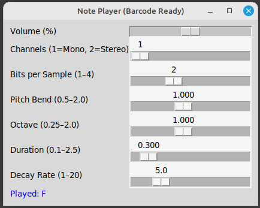

Ah its a simple barcode scaner to play music.  
you dont need to use the barcode scanner though, you can just type in the terminal.  
The GUI listens for inputs but allows you to adjust the parameters of the notes while you play. 

Todo: 
Atack and decay, sustain my releases. figure the whole octive thing out. 
add UPC codes that play predefined tunes. 

Thank you EPIC RAP BATTLES OF HISTORY, I learned something about music.
